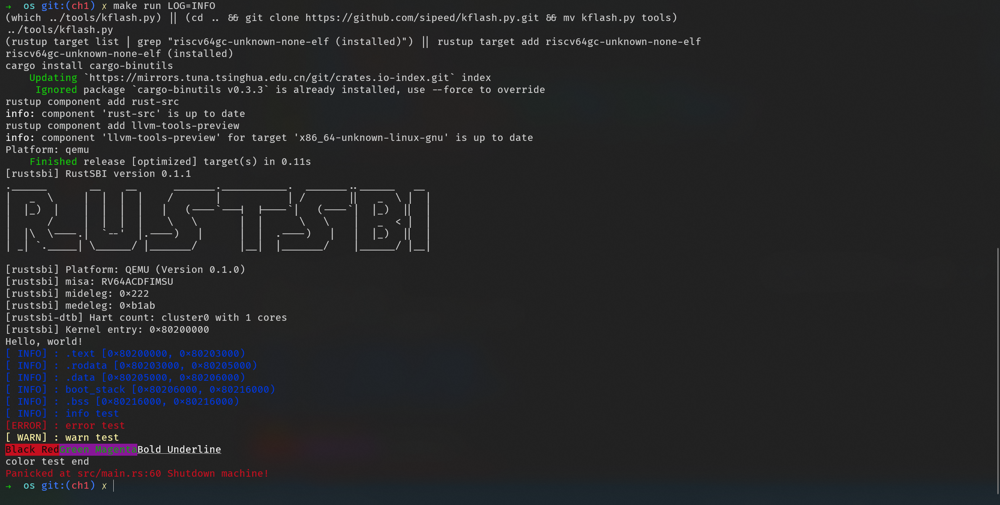
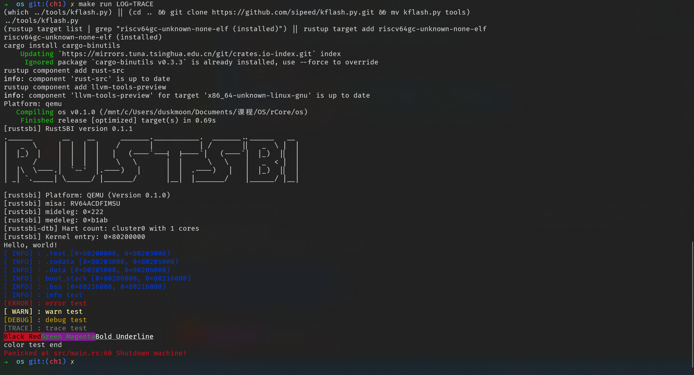

# lab1

> 贺鲲鹏 无 85 2018011169

## 实现简述

- 在 `console` 模块中增加宏 `colorize!`、`print_colorized!` 和 `println_colorized!`，增加函数 `print_colorized`，增加常用 ANSI 转义序列到枚举 `ANSICON`，以支持带有颜色、粗体以及下划线的输出。
- 增加基于 `log` crate 的 `logger` 模块，参考 `log` 的文档和 `rCore` 相关部分实现，支持根据等级输出相应的带颜色日志。
- 修改 `lang_items` 中的 `panic` 函数以红色字输出。

实现效果如下图





## 问答

### 1

查看 `rustsbi` 代码，相关委托部分源代码如下：

```rust
// 把S的中断全部委托给S层
unsafe {
    mideleg::set_sext();
    mideleg::set_stimer();
    mideleg::set_ssoft();
    medeleg::set_instruction_misaligned();
    medeleg::set_breakpoint();
    medeleg::set_user_env_call();
    medeleg::set_instruction_page_fault();
    medeleg::set_load_page_fault();
    medeleg::set_store_page_fault();
    medeleg::set_instruction_fault();
    medeleg::set_load_fault();
    medeleg::set_store_fault();
    mie::set_mext();
    // 不打开mie::set_mtimer
    mie::set_msoft();
}
```

即通过 mideleg 和 medeleg 两个寄存器进行委托。在运行时，`rustsbi` 输出两个寄存器的值为 `mideleg: 0x222 medeleg: 0xb1ab`。

### 2

机器加电后，首先执行下面五行指令

```
0x1000:      auipc   t0,0x0         t0 => 0x1000
0x1004:      addi    a1,t0,32       a1 => 0x1020
0x1008:      csrr    a0,mhartid     a0 => mhartid 0
0x100c:      ld      t0,24(t0)      t0 => 0x80000000
0x1010:      jr      t0

24(0x1000) 内容
0x1018:      unimp
0x101a:      0x8000
```

这几行将 `rustsbi` 的起始地址 `0x80000000` 载入 `t0` 寄存器并跳转，并通过 `a0` 和 `a1` 进行传参。跳转后进入 `rustsbi` 的 `start()` 函数，前几行内容如下：

```
rustsbi code
0x80000000:  csrr    a2,mhartid     a2 0 ?
0x80000004:  lui     t0,0x0         t0 => 0 : %hi(_max_hart_id) = 0
0x80000008:  addi    t0,t0,7        t0 => 7 : %lo(_max_hart_id) = 7
0x8000000c:
 bltu        t0,a2,0x8000003a       t0 7 > a2 0, b F : _stack_abort = 0x8000003a
0x80000010:  auipc   sp,0x200       sp => 0x80200010 <rust_main>
0x80000014:  addi    sp,sp,-16      sp => 0x80200000 <stext>
...
```

这一部分加载了 `rust_main` 的起始地址。此后是 `rust_sbi` 的初始化，然后进入 `rust_sbi` 的 `main()` 函数。这其中有初始化机器监管自陷向量基地址寄存器，委托异常和中断等。最后通过 `s_mode_start()` 函数进入 `stext` 并接着执行 `rust_main`。
