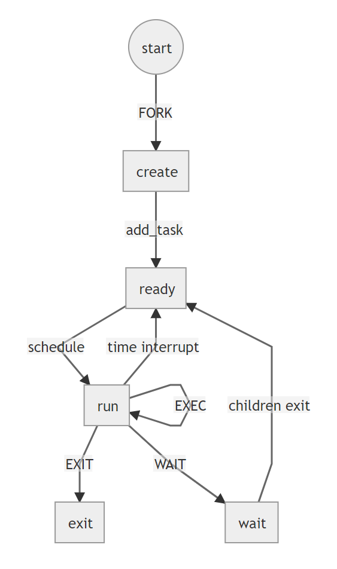

# lab 5

> 贺鲲鹏 2018011169

## 实现简述

- 添加 `sys_spawn` 及相关函数
- 重新导出 `mmap` `munmap` `set_priority`
- 使用 `fmt` `clippy` 对框架代码进行了一定的修改

## 思考题

### 1

与本次实验一样实现一个 `spawn` 来替代 `fork + exec` 是一种策略。也可以采用 `copy on write`，即不写数据就不复制，共享同一片资源。

### 2

- 复杂的进程需要实现复杂的 `CoW`，带来的开销可能比实现一个 `spawn` 多很多。
- `fork` 产生的子进程线程不安全，只会复制调用的线程。
- `fork` 不安全，需要显式地释放与子进程不共享的资源。
- `fork` 速度慢，结合 `exec` 需要进行两次内存操作。

### 3

```rust
fn spawn(file: *const u8, param: isize) -> usize {
    let path = parse(file);
    spawn(path.as_str(), param)
}

fn another_main(a: isize) -> isize {
    let b = get_b()
    println!("a + b = {}", a + b);
    0
}

fn main() -> isize {
    let a = get_a();
    spawn("another_main".as_ptr(), a);
    println!("a = {}", a);
    0
}
```

### 4


